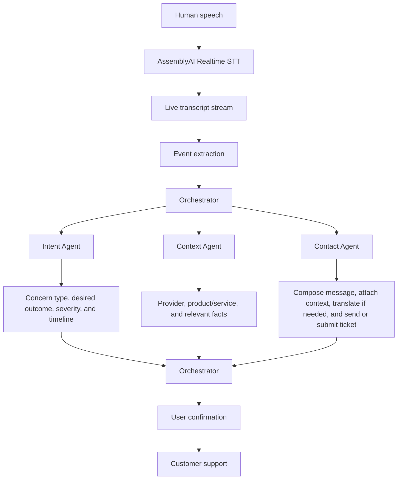
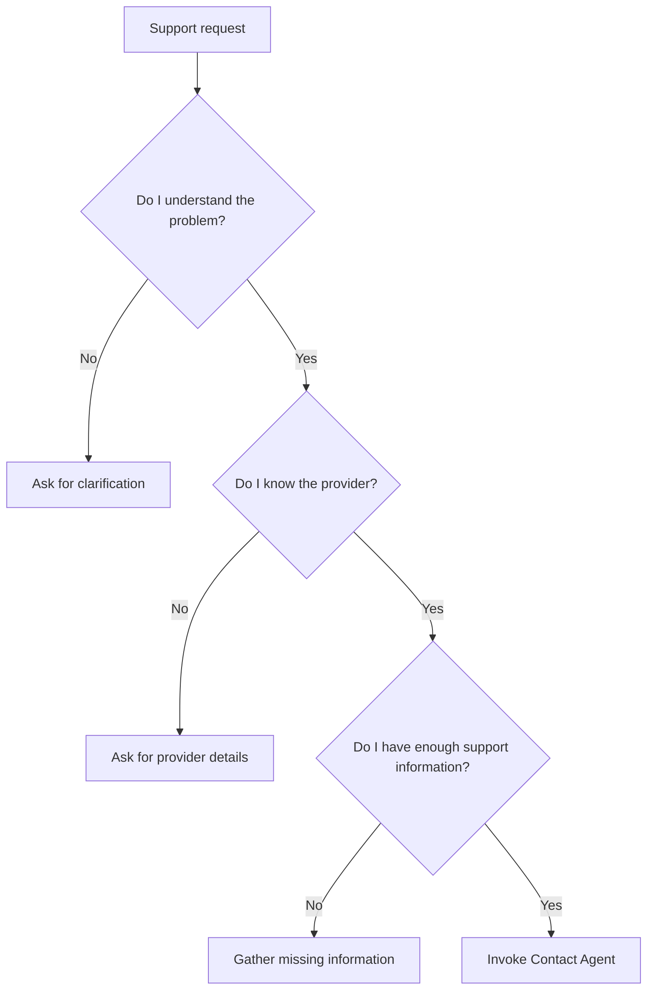
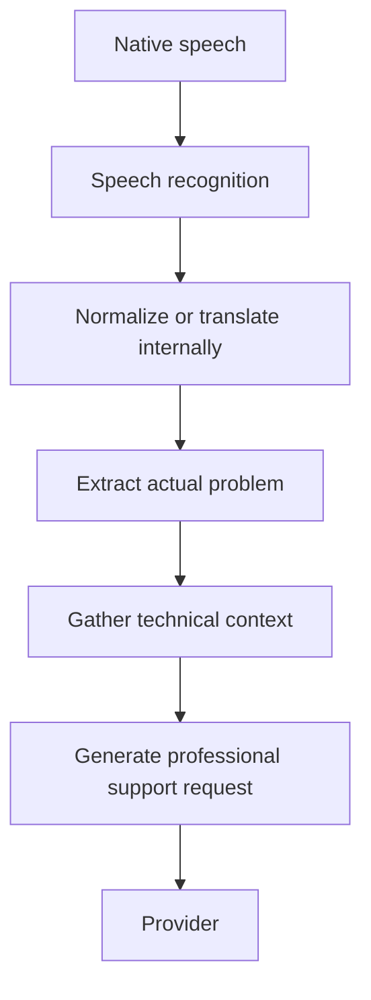

# Universal Customer-Support Access Layer

> Speak your problem once. The platform figures out who needs to hear it, what information they need, and contacts them for you.

## Conceptual workflow



## Agents

### 1. Orchestrator

The Orchestrator owns the entire workflow. It decides whether the system has:

1. Understood the problem.
2. Identified the provider.
3. Collected enough support information.

Once those conditions are satisfied, it invokes the Contact Agent.



### 2. Intent Agent

The Intent Agent converts casual speech into a structured support request.

**Example input**

> “Our internet has been terrible since last night. It keeps disconnecting every five minutes and I already restarted the router twice.”

**Example output**

```json
{
  "category": "internet_connectivity",
  "problem": "intermittent_connection",
  "started": "last night",
  "severity": "high",
  "attempted_resolutions": [
    "router_restart"
  ],
  "desired_resolution": "restore_stable_connection"
}
```

### 3. Context Agent

The Context Agent determines:

- The company or provider
- The product or service
- The equipment model
- The problem category
- Troubleshooting already performed
- Information required by that company's support team

**Example input**

> “My Converge connection keeps dropping and the LOS light keeps blinking red.”

**Example context**

| Field | Value |
| --- | --- |
| Provider | Converge ICT |
| Service | Residential fiber internet |
| Equipment | Fiber ONU/router |
| Indicator | LOS blinking red |
| Likely category | Fiber optical signal / connectivity issue |
| Already attempted | Router restart |

**Information potentially required**

- Account number
- Subscriber name
- Service address
- Router status

### 4. Contact Agent

The Contact Agent is the action agent. It receives structured context such as:

```json
{
  "provider": "Converge ICT",
  "problem": "...",
  "customer_context": "...",
  "preferred_channel": "email"
}
```

It turns that context into an appropriate support request.

**Example generated message**

> Hello Converge Support,
>
> I'm experiencing intermittent internet connectivity since approximately 10 PM yesterday. The LOS indicator on my ONU is blinking red, and the connection disconnects approximately every five minutes.
>
> I have already restarted the router, but the issue persists.
>
> Could you please check whether there is an outage or line issue affecting my connection?

**Example confirmation**

> **Ready to contact Converge**
>
> - **Channel:** Email
> - **Issue:** Internet connectivity
> - **Priority:** High
>
> [Review Message] [Send]

## Native-language input

Someone should not need to know how to communicate a technical problem in formal English. They can describe the issue naturally in their own language.

**Example input (Cebuano)**

> “Sige ra gyud og kawala among internet unya pula ang LOS. Gi restart na nako ang router pero mao gihapon.”

The system's conceptual pipeline becomes:


